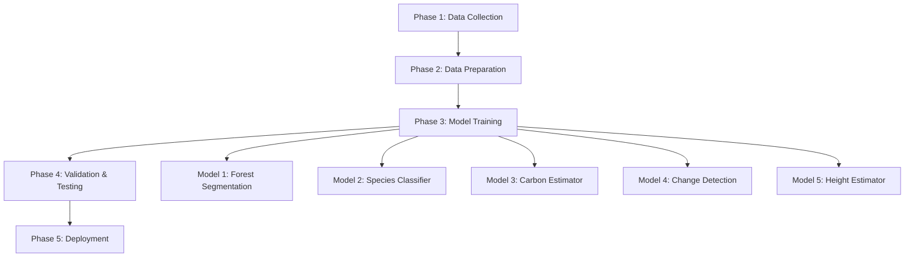

# 🎓 AI Model Training Roadmap
## CarbonSphere AI - Custom Forest Analysis Models

> **Document Purpose**: This roadmap outlines the complete training pipeline for production-grade AI models specifically designed for forest carbon credit analysis.

---

## 📊 Current Status

### ✅ **Models Currently Deployed (Pre-trained)**
| Model | Source | Dataset | Status |
|-------|--------|---------|--------|
| ResNet50 | PyTorch Hub | ImageNet (1.2M images) | ✅ Working |
| DeepLabV3-ResNet50 | PyTorch Hub | COCO (330K images) | ✅ Working |
| HSV Segmentation | OpenCV | N/A (Rule-based) | ✅ Working |

**Limitation**: These models are trained on general datasets, not forest-specific imagery.

### ❌ **Models Requiring Custom Training**
5 specialized models need to be trained on forest-specific datasets for production deployment.

---

## 🗺️ Training Roadmap Overview



---

## 🎯 Model 1: Forest Segmentation U-Net (Priority: HIGH)

### **Objective**
Pixel-level classification of forest vs non-forest areas from satellite imagery.

### **Architecture**
- **Base Model**: U-Net or DeepLabV3+
- **Backbone**: ResNet50/101 or EfficientNet-B4
- **Input Size**: 512×512 pixels
- **Output**: Binary mask (forest/non-forest)

### **Dataset Requirements**

#### **Recommended Datasets**
1. **Sentinel-2 Forest Dataset** (Primary)
   - Source: ESA Copernicus / Kaggle
   - Size: ~50,000 labeled tiles
   - Resolution: 10m per pixel
   - Download: [Sentinel-2 Cloud-Free Mosaics](https://registry.opendata.aws/sentinel-2/)

2. **ForestNet Dataset** (Secondary)
   - Source: Stanford University
   - Size: 24,000+ labeled images
   - Coverage: Global forest types
   - Link: [ForestNet GitHub](https://github.com/stanfordmlgroup/forestnet)

3. **LandCover.ai** (Supplementary)
   - Source: Polish Geoportal
   - Size: 41 orthophotos, 33 classes
   - Resolution: 25-50cm per pixel
   - Link: [LandCover.ai](https://landcover.ai/)

#### **Data Collection Steps**
```bash
# 1. Download Sentinel-2 imagery
pip install sentinelsat
python scripts/download_sentinel2.py --region "your_region" --start-date 2020-01-01

# 2. Download ForestNet
git clone https://github.com/stanfordmlgroup/forestnet
cd forestnet && python download_data.py

# 3. Prepare annotations
python scripts/prepare_masks.py --input sentinel2/ --output masks/
```

### **Training Configuration**

```python
# training_config.yaml
model:
  architecture: "unet"
  backbone: "resnet50"
  encoder_weights: "imagenet"
  
training:
  epochs: 100
  batch_size: 16
  learning_rate: 0.0001
  optimizer: "Adam"
  loss: "DiceLoss + BCE"
  
augmentation:
  - RandomRotate90
  - HorizontalFlip
  - VerticalFlip
  - RandomBrightnessContrast
  - GaussianNoise
  
hardware:
  gpu: "NVIDIA RTX 3090 or better"
  vram: "24GB minimum"
```

### **Training Timeline**
- **Data Collection**: 1-2 weeks
- **Data Preprocessing**: 3-5 days
- **Training**: 5-7 days (100 epochs)
- **Validation**: 2-3 days
- **Total**: ~3-4 weeks

### **Expected Performance**
- **IoU (Intersection over Union)**: 85-92%
- **Pixel Accuracy**: 90-95%
- **F1 Score**: 88-93%

### **Training Script Template**

```python
# train_forest_segmentation.py
import torch
import segmentation_models_pytorch as smp
from torch.utils.data import DataLoader

# 1. Load Dataset
train_dataset = ForestDataset(
    images_dir="data/sentinel2/train/images",
    masks_dir="data/sentinel2/train/masks",
    augmentation=get_training_augmentation()
)

# 2. Initialize Model
model = smp.Unet(
    encoder_name="resnet50",
    encoder_weights="imagenet",
    classes=1,
    activation='sigmoid'
)

# 3. Training Loop
optimizer = torch.optim.Adam(model.parameters(), lr=1e-4)
criterion = smp.losses.DiceLoss() + torch.nn.BCEWithLogitsLoss()

for epoch in range(100):
    train_one_epoch(model, train_loader, optimizer, criterion)
    validate(model, val_loader)
    save_checkpoint(model, f"checkpoints/unet_epoch_{epoch}.pth")
```

### **Cost Estimate**
- **Cloud GPU (AWS p3.2xlarge)**: $3.06/hour × 168 hours = **$514**
- **Storage (S3)**: ~$50/month
- **Total**: **~$600**

---

## 🌲 Model 2: Tree Species Classifier (Priority: MEDIUM)

### **Objective**
Classify tree species from aerial/satellite imagery for accurate carbon calculations.

### **Architecture**
- **Base Model**: EfficientNet-B4 or Vision Transformer (ViT)
- **Input Size**: 224×224 pixels
- **Output**: Species class (e.g., Oak, Pine, Eucalyptus)

### **Dataset Requirements**

#### **Recommended Datasets**
1. **TreeSatAI Benchmark**
   - Source: TU Munich
   - Size: 50,000+ labeled trees
   - Species: 15 European species
   - Link: [TreeSatAI](https://zenodo.org/record/6780578)

2. **NEON Tree Species Dataset**
   - Source: National Ecological Observatory Network
   - Size: 100,000+ annotations
   - Coverage: North American forests
   - Link: [NEON Data Portal](https://data.neonscience.org/)

3. **Custom Dataset** (Recommended)
   - Collect local species data
   - Partner with forestry departments
   - Size: 5,000-10,000 images per species

### **Training Configuration**

```python
# species_classifier_config.yaml
model:
  architecture: "efficientnet_b4"
  num_classes: 20  # Adjust based on species
  pretrained: true
  
training:
  epochs: 50
  batch_size: 32
  learning_rate: 0.001
  scheduler: "CosineAnnealingLR"
  optimizer: "AdamW"
  loss: "CrossEntropyLoss"
  
data_split:
  train: 0.7
  val: 0.15
  test: 0.15
```

### **Training Timeline**
- **Data Collection**: 2-4 weeks
- **Data Labeling**: 1-2 weeks (if custom)
- **Training**: 3-5 days
- **Total**: ~5-7 weeks

### **Expected Performance**
- **Top-1 Accuracy**: 80-88%
- **Top-5 Accuracy**: 92-96%

### **Cost Estimate**
- **Cloud GPU**: $3.06/hour × 72 hours = **$220**
- **Labeling (if outsourced)**: $0.10/image × 10,000 = **$1,000**
- **Total**: **~$1,200**

---

## 💰 Model 3: Carbon Density Estimator (Priority: MEDIUM)

### **Objective**
Predict carbon storage (tons/hectare) directly from imagery using regression.

### **Architecture**
- **Base Model**: ResNet50 + Regression Head
- **Input**: Multi-spectral satellite imagery (RGB + NIR)
- **Output**: Carbon density value (continuous)

### **Dataset Requirements**

#### **Data Sources**
1. **Field Measurements**
   - Ground truth carbon measurements
   - LiDAR-derived biomass estimates
   - Forest inventory data
   - Size: 5,000-15,000 samples

2. **Satellite Imagery**
   - Sentinel-2 (10m resolution)
   - Landsat 8 (30m resolution)
   - Planet Labs (3m resolution, commercial)

3. **Existing Datasets**
   - **GEDI L4A** (NASA): Aboveground biomass
   - **Global Forest Biomass**: ESA CCI dataset
   - Link: [GEDI Data](https://daac.ornl.gov/GEDI/)

### **Training Configuration**

```python
# carbon_estimator_config.yaml
model:
  architecture: "resnet50_regression"
  input_channels: 4  # RGB + NIR
  output_dim: 1  # Carbon density
  
training:
  epochs: 80
  batch_size: 24
  learning_rate: 0.0005
  optimizer: "Adam"
  loss: "MSELoss + L1Loss"
  metrics: ["MAE", "RMSE", "R2"]
```

### **Training Timeline**
- **Data Collection**: 3-6 weeks
- **Data Alignment**: 1 week
- **Training**: 4-6 days
- **Total**: ~6-8 weeks

### **Expected Performance**
- **R² Score**: 0.75-0.85
- **RMSE**: 15-25 tons/hectare

### **Cost Estimate**
- **Cloud GPU**: $3.06/hour × 96 hours = **$294**
- **Field Data (if needed)**: $5,000-$20,000
- **Total**: **~$5,300-$20,300**

---

## 🔄 Model 4: Change Detection (Priority: MEDIUM)

### **Objective**
Detect deforestation, reforestation, and forest degradation over time.

### **Architecture**
- **Base Model**: Siamese Network or Temporal CNN
- **Input**: Image pairs (before/after)
- **Output**: Change mask + change type

### **Dataset Requirements**

#### **Recommended Datasets**
1. **PRODES Deforestation Dataset**
   - Source: Brazilian Amazon monitoring
   - Size: 30+ years of data
   - Link: [PRODES](http://www.obt.inpe.br/OBT/assuntos/programas/amazonia/prodes)

2. **Hansen Global Forest Change**
   - Source: University of Maryland
   - Coverage: Global, 2000-2023
   - Resolution: 30m
   - Link: [Global Forest Watch](https://data.globalforestwatch.org/)

3. **OSCD (Onera Satellite Change Detection)**
   - Source: ONERA
   - Size: 24 image pairs
   - Link: [OSCD Dataset](https://rcdaudt.github.io/oscd/)

### **Training Configuration**

```python
# change_detection_config.yaml
model:
  architecture: "siamese_unet"
  backbone: "resnet34"
  fusion: "concatenation"
  
training:
  epochs: 60
  batch_size: 8
  learning_rate: 0.0001
  optimizer: "Adam"
  loss: "FocalLoss + DiceLoss"
```

### **Training Timeline**
- **Data Collection**: 2-3 weeks
- **Training**: 4-6 days
- **Total**: ~4-5 weeks

### **Expected Performance**
- **F1 Score**: 75-85%
- **Precision**: 80-88%
- **Recall**: 72-82%

### **Cost Estimate**
- **Cloud GPU**: $3.06/hour × 96 hours = **$294**
- **Total**: **~$300**

---

## 📏 Model 5: Tree Canopy Height Estimator (Priority: LOW)

### **Objective**
Estimate tree height from satellite/aerial imagery for biomass calculations.

### **Architecture**
- **Base Model**: CNN Regression or Transformer
- **Input**: Stereo imagery or single image + metadata
- **Output**: Height map (meters)

### **Dataset Requirements**

#### **Data Sources**
1. **LiDAR Data** (Ground Truth)
   - USGS 3DEP Program
   - State forestry LiDAR surveys
   - Commercial LiDAR providers

2. **Satellite Imagery**
   - WorldView-3 (stereo pairs)
   - Pléiades (stereo)
   - Sentinel-2 (with DEM)

3. **Existing Datasets**
   - **GEDI L2A**: Tree height measurements
   - **Global Canopy Height**: ETH Zurich
   - Link: [ETH Canopy Height](https://langnico.github.io/globalcanopyheight/)

### **Training Timeline**
- **Data Collection**: 3-4 weeks
- **Training**: 5-7 days
- **Total**: ~5-6 weeks

### **Expected Performance**
- **RMSE**: 2-4 meters
- **R² Score**: 0.70-0.82

### **Cost Estimate**
- **Cloud GPU**: $3.06/hour × 120 hours = **$367**
- **LiDAR Data**: $500-$2,000
- **Total**: **~$900-$2,400**

---

## 📅 Complete Training Schedule

### **Phase 1: Foundation (Months 1-2)**
- ✅ Set up training infrastructure (GPU cluster, storage)
- ✅ Collect and prepare datasets
- ✅ Establish data pipelines
- 🎯 **Train Model 1**: Forest Segmentation U-Net

### **Phase 2: Classification (Month 3)**
- 🎯 **Train Model 2**: Tree Species Classifier
- ✅ Integrate Model 1 into production

### **Phase 3: Advanced Analytics (Months 4-5)**
- 🎯 **Train Model 3**: Carbon Density Estimator
- 🎯 **Train Model 4**: Change Detection
- ✅ A/B testing with existing models

### **Phase 4: Enhancement (Month 6)**
- 🎯 **Train Model 5**: Height Estimator
- ✅ Fine-tune all models
- ✅ Production deployment

### **Gantt Chart**
```
Month 1: [████████] Infrastructure + Data Collection
Month 2: [████████] Model 1 Training (Forest Seg)
Month 3: [████████] Model 2 Training (Species)
Month 4: [████████] Model 3 Training (Carbon)
Month 5: [████████] Model 4 Training (Change)
Month 6: [████████] Model 5 + Fine-tuning
```

---

## 💰 Total Cost Breakdown

| Item | Cost |
|------|------|
| **Cloud GPU Training** | $1,695 |
| **Data Storage (6 months)** | $300 |
| **Dataset Licensing** | $500-$2,000 |
| **Field Data Collection** | $5,000-$20,000 |
| **Data Labeling** | $1,000-$3,000 |
| **Infrastructure Setup** | $1,000 |
| **Contingency (20%)** | $1,900-$5,600 |
| **TOTAL** | **$11,395 - $34,095** |

### **Budget Optimization Options**
1. **Use Free Datasets**: Reduce cost by $5,000-$20,000
2. **Academic GPU Access**: Free via university partnerships
3. **Self-Labeling**: Save $1,000-$3,000
4. **Optimized Training**: Reduce GPU time by 30%

**Minimum Budget**: ~$2,000 (using free resources)

---

## 🛠️ Infrastructure Requirements

### **Hardware**
- **GPU**: NVIDIA RTX 3090 / A100 (24GB+ VRAM)
- **CPU**: 16+ cores
- **RAM**: 64GB+
- **Storage**: 2TB SSD + 10TB HDD

### **Software Stack**
```bash
# Core Libraries
torch==2.0.1
torchvision==0.15.2
segmentation-models-pytorch==0.3.3
albumentations==1.3.1
opencv-python==4.8.0

# Data Processing
rasterio==1.3.8
geopandas==0.13.2
sentinelsat==1.2.1

# Experiment Tracking
wandb==0.15.8
tensorboard==2.13.0
```

### **Cloud Alternatives**
1. **AWS SageMaker**: Managed training
2. **Google Colab Pro+**: $50/month, limited GPU
3. **Paperspace Gradient**: $0.51/hour (RTX 5000)
4. **Lambda Labs**: $1.10/hour (A100)

---

## 📈 Performance Monitoring

### **Key Metrics to Track**
1. **Training Metrics**
   - Loss curves
   - Validation accuracy
   - Learning rate schedule

2. **Business Metrics**
   - Carbon estimation accuracy vs ground truth
   - Processing time per image
   - Cost per analysis

3. **Production Metrics**
   - Inference latency
   - Model drift
   - User feedback scores

### **Monitoring Tools**
- **Weights & Biases**: Experiment tracking
- **TensorBoard**: Visualization
- **MLflow**: Model registry
- **Prometheus + Grafana**: Production monitoring

---

## 🚀 Deployment Strategy

### **Model Serving Options**

#### **Option 1: FastAPI (Current)**
```python
# Integrate trained model
from trained_models import ForestSegmentationModel

model = ForestSegmentationModel.load("models/forest_seg_v1.pth")

@app.post("/api/v1/forest/segment")
async def segment_forest(image: UploadFile):
    result = model.predict(image)
    return {"mask": result.tolist()}
```

#### **Option 2: TorchServe**
- Production-grade serving
- Auto-scaling
- Model versioning

#### **Option 3: ONNX Runtime**
- Cross-platform
- Optimized inference
- 2-3x faster than PyTorch

### **Deployment Checklist**
- [ ] Convert models to ONNX format
- [ ] Set up model versioning
- [ ] Implement A/B testing
- [ ] Configure auto-scaling
- [ ] Set up monitoring alerts
- [ ] Create rollback procedures

---

## 📚 Learning Resources

### **Courses**
1. **Deep Learning for Computer Vision** - Stanford CS231n
2. **Satellite Image Analysis** - Coursera (Copernicus)
3. **Forest Remote Sensing** - NASA ARSET

### **Papers to Read**
1. "U-Net: Convolutional Networks for Biomedical Image Segmentation"
2. "DeepForest: A Python Package for RGB Deep Learning Tree Crown Delineation"
3. "Estimating Aboveground Biomass from Satellite Imagery"

### **Communities**
- **Kaggle**: Forest-related competitions
- **Papers with Code**: Latest research
- **r/MachineLearning**: Discussion forum

---

## ✅ Success Criteria

### **Model 1 (Forest Segmentation)**
- ✅ IoU > 85%
- ✅ Inference time < 2 seconds per image
- ✅ Works on Sentinel-2 and aerial imagery

### **Model 2 (Species Classifier)**
- ✅ Top-1 Accuracy > 80%
- ✅ Supports 15+ species
- ✅ Inference time < 0.5 seconds

### **Model 3 (Carbon Estimator)**
- ✅ R² > 0.75
- ✅ RMSE < 25 tons/hectare
- ✅ Validated against field measurements

### **Model 4 (Change Detection)**
- ✅ F1 Score > 75%
- ✅ Detects changes > 0.5 hectares
- ✅ Works with multi-year data

### **Model 5 (Height Estimator)**
- ✅ RMSE < 4 meters
- ✅ Works without LiDAR input
- ✅ Inference time < 1 second

---

## 🎯 Next Steps

### **Immediate Actions (Week 1)**
1. ✅ Set up AWS/GCP account with GPU quota
2. ✅ Download Sentinel-2 and ForestNet datasets
3. ✅ Create training data pipeline
4. ✅ Set up experiment tracking (W&B)

### **Short-term (Month 1)**
1. 🎯 Train baseline Forest Segmentation model
2. 🎯 Establish validation metrics
3. 🎯 Create model evaluation dashboard

### **Long-term (6 Months)**
1. 🎯 Complete all 5 model trainings
2. 🎯 Deploy to production
3. 🎯 Publish results/research paper

---

## 📞 Support & Collaboration

### **Potential Partners**
- **Universities**: Forest science departments
- **NGOs**: Conservation organizations
- **Government**: Forestry departments
- **Companies**: Satellite imagery providers

### **Funding Opportunities**
- **Research Grants**: NSF, NASA, ESA
- **Carbon Credits**: Pre-sell verified credits
- **Competitions**: Kaggle, Zindi (prize money)

---

## 📝 Conclusion

This roadmap provides a complete path from pre-trained models to production-grade custom AI for forest carbon analysis. The total timeline is **6 months** with a budget range of **$2,000-$34,000** depending on resource availability.

**Key Takeaway**: Start with **Model 1 (Forest Segmentation)** as it provides the highest immediate value and can be trained with publicly available datasets.

---

**Document Version**: 1.0  
**Last Updated**: 2026-02-13  
**Author**: CarbonSphere AI Team  
**Status**: Ready for Implementation
