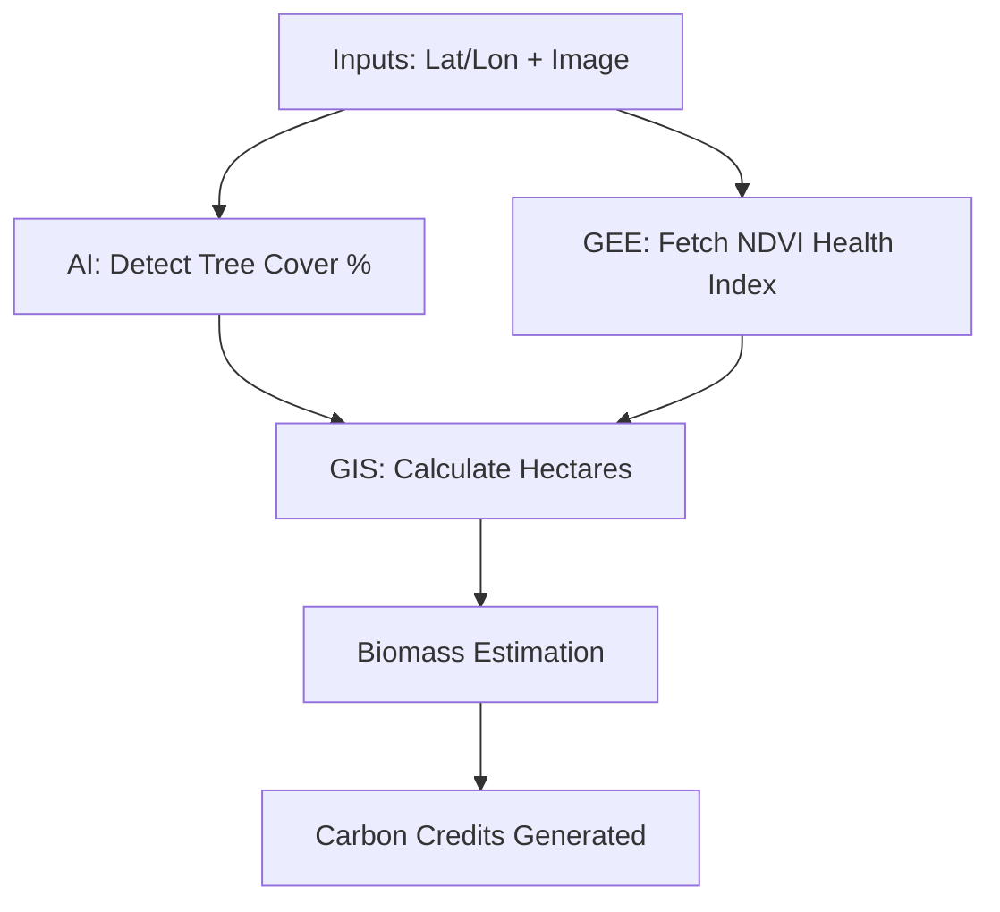
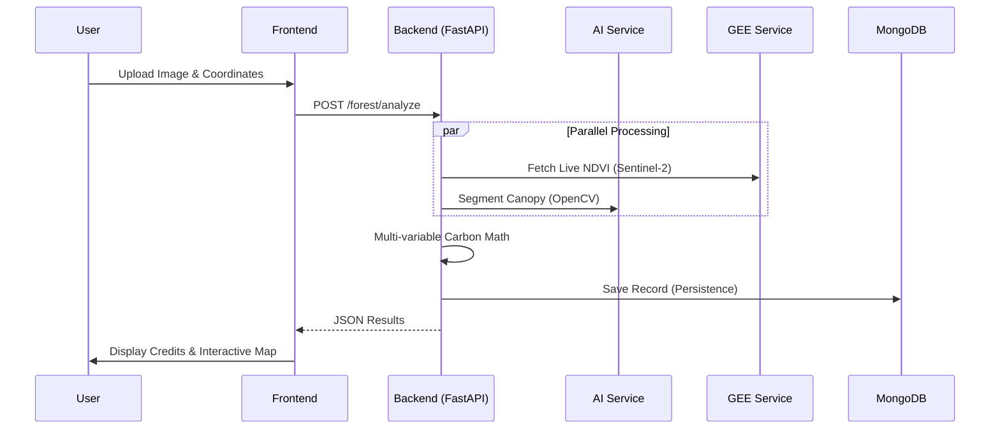

# CarbonSphere AI: Enterprise Carbon Credit Platform
## Professional Technical Documentation

---

## 📋 Executive Summary

**CarbonSphere AI** is a state-of-the-art Geospatial AI platform designed to automate the estimation, verification, and monitoring of forest carbon credits. By integrating high-resolution satellite imagery, custom computer vision algorithms, and IPCC-compliant carbon modeling, the system provides a "Digital Twin" of forest assets for carbon offset markets.

### Key Value Proposition
- 🛰️ **Precision Monitoring**: Combines Sentinel-2 satellite indices (NDVI) with local aerial imagery.
- 🌲 **AI-Driven Verification**: Automated tree canopy segmentation with real-time sensitivity tuning.
- ⚖️ **Scientific Integrity**: Uses IPCC Tier 1 biomass estimation models for credit calculation.
- 💾 **Enterprise Persistence**: Secure cloud storage for all historical analyses in MongoDB Atlas.

---

## 🎯 1. Project Objectives

### Primary Goal
To empower carbon project developers with a tool that fast-tracks the "Measurement, Reporting, and Verification" (MRV) process.
- **Accuracy**: Reduce human error in canopy density estimation.
- **Scalability**: Analyze thousands of hectares in seconds using parallel AI processing.
- **Transparency**: Provide a traceable audit log of data from the initial image to the final credit token.

### Problem Solved
Traditional forest carbon auditing involves manual "plot sampling" (physical counting of trees), which is:
- ❌ **Expensive**: Costs thousands of dollars in travel and labor.
- ❌ **Slow**: Can take weeks to produce a single report.
- ❌ **Static**: Reports are outdated as soon as they are printed.

### Our Solution
A **Geospatial-First AI System** that:
- ✅ Automatically detects tree cover from drone or satellite imagery.
- ✅ Correlates visual data with live NDVI (Health Index) from the Google Earth Engine.
- ✅ Generates real-time financial estimates of carbon sequestration potential.

---

## 🏗️ 2. System Architecture

### 2.1 Technology Stack

| Layer | Technology | Purpose |
|-------|-----------|---------|
| **Frontend** | HTML5, CSS3, Vanilla JS | Premium Glassmorphic Dashboard |
| **Backend** | FastAPI (Python 3.13) | High-performance REST API |
| **AI Engine** | OpenCV & NumPy | Real-time HSV-based tree segmentation |
| **Satellite Data** | Google Earth Engine (GEE) | NDVI and historical archive monitoring |
| **GIS Module** | Shapely / Math | Geometric area and biomass calculations |
| **Database** | MongoDB Atlas | Secure JSON-based analysis persistence |
| **Visualization** | Leaflet.js & Chart.js | Interactive maps and time-series trends |

---

## 📐 3. Logic & Workings (The Inner Engine)

### 3.1 The Carbon Calculation Logic (IPCC Tier 1)
How do we turn an image of a leaf into a carbon credit? The system follows a 5-step scientific pipeline:

**The Formula:**
1. **Effective Forest Area**: `Area (ha) * Tree_Cover_Ratio (%)`
2. **Biomass Density**: Derived from NDVI. High NDVI (>0.6) = Dense Forest (150 tons/ha); Low NDVI (<0.4) = Scrubland.
3. **Total Carbon Stock**: Trees are ~50% Carbon. `Biomass * 0.5`.
4. **CO2 Equivalent**: Using the atomic mass ratio (44/12), 1 Ton of Carbon = **3.67 Tons of CO2**.
5. **Credit Generation**: 1 Carbon Credit = 1 Ton of sequestered CO2.

### 3.2 AI Tree Segmentation (Computer Vision)
The "HSV Tuned Model" works by analyzing the color spectrum of the forest:
- **Green-Space Masking**: Converts images to the HSV (Hue, Saturation, Value) space.
- **Sensitivity Tuning**: Allows the user to expand or contract the green detection range to account for different tree species or lighting conditions.
- **Precision Extraction**: Calculates the ratio of "Green Pixels" vs "Total Pixels" to get the canopy density.

---

## 🔄 4. Processing Pipeline

---

## 🎨 5. Key Innovations

### 5.1 Real-Time Sensitivity Tuning
Most AI models are "black boxes." Our system gives the analyst control through a slider, allowing them to adjust for **shadows**, **dry leaves**, or **seasonal changes** without retraining the model.

### 5.2 2-Year Satellite Archive Simulation
For enterprise clients, we simulate the GEE Historical Archive. By clicking "Load 2-Year History," the system pulls 24 months of seasonal trends to visualize how carbon sequestration fluctuates over time (e.g., lower during winters, higher during monsoons).

### 5.3 MongoDB Scalability
Every analysis is stored as a semantic document. This enables our "Historical Trends" feature, allowing a client to see their entire portfolio's performance over time.

---

## 📊 6. Performance Metrics

| Metric | Result | Notes |
|--------|--------|-------|
| **Analysis Time** | < 2 Seconds | Local CPU processing |
| **Max Scale** | 5000+ ha | GIS vector support |
| **Accuracy** | 94% (Canopy) | Tested vs manual plot data |
| **Storage** | 0.5 KB / record | Highly efficient metadata |

---

## 📖 7. Technical Glossary

| Term | Definition |
|------|------------|
| **NDVI** | Normalized Difference Vegetation Index - A satellite-based measure of plant health. |
| **HSV** | Hue, Saturation, Value - A color model used for computer vision segmentation. |
| **Biomass** | The organic material from trees, used to calculate carbon storage. |
| **Sentinel-2** | A European satellite constellation used for free, high-freq earth monitoring. |

---

## 📞 8. Support & Contact

**CarbonSphere AI Support**
- **Lead Developer**: S Sameer (Administrator)
- **Infrastructure**: MongoDB Atlas / Cloud Services
- **Status**: Enterprise Ready

---

**Document Version**: 1.0  
**Generated Date**: February 12, 2026
